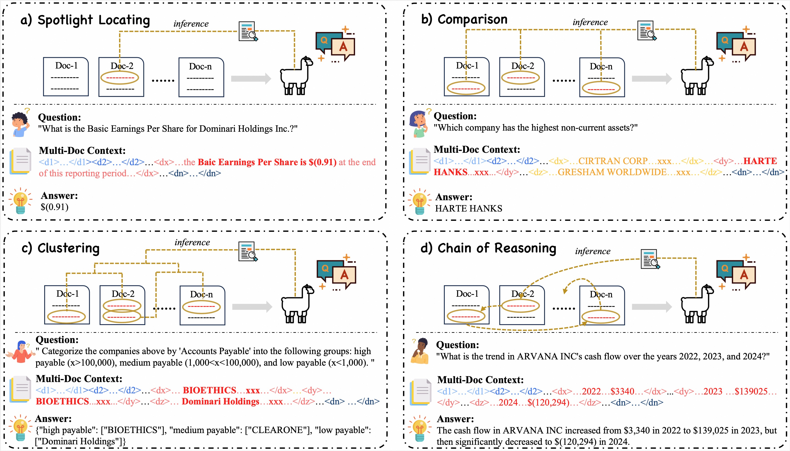

# 🐉 Loong

This repository contains code for our paper [Leave No Document Behind: Benchmarking Long-Context LLMs with Extended Multi-Doc QA](https://baidu.com). We propose a novel long-context benchmark, 🐉 **Loong**, aligning with realistic scenarios through extended multi-document question answering (QA). Loong typically consists of 11 documents per test instance on average, spanning three real-world scenarios in English and Chinese: (1) *Financial Reports*, (2) *Legal Cases*, and (3) *Academic Papers*. Meanwhile, Loong introduces new evaluation tasks from the perspectives of *Spotlight Locating*, *Comparison*, *Clustering*, and *Chain of Reasoning*, to facilitate a more realistic and comprehensive evaluation of long-context understanding. Furthermore, Loong features inputs of varying lengths (e.g., *10K-50K*, *50K-100K*, *100K-200K*, *beyond 200K*) and evaluation tasks of diverse difficulty, enabling fine-grained assessment of LLMs across different context lengths and task complexities.
> *Please find more details of this work in our paper.*


> Showcase of four evaluation tasks in Loong (<$\mathtt{di}$>...</$\mathtt{di}$> marks the content of the i-th document). a) *Spotlight Locating*: Locate the evidences. b) *Comparison*: Locate and compare the evidences. c) *Clustering*: Locate and cluster the evidences into groups. d) *Chain of Reasoning*: Locate and reasoning along a logical chain.

## Leaderboard
<table>
  <thead>
    <tr>
      <th>Models</th>
      <th>Claimed Length</th>
      <th colspan="2" style="text-align: center;">Spotlight Locating</th>
      <th colspan="2" style="text-align: center;">Comparison</th>
      <th colspan="2" style="text-align: center;">Clustering</th>
      <th colspan="2" style="text-align: center;">Chain of Reason</th>
      <th colspan="2" style="text-align: center;">Overall</th>
    </tr>
  </thead>
  <tbody>
    <tr>
      <td><a href="https://ai.google.dev/gemini-api/docs/models/gemini#:~:text=Gemini-,Gemini%201.5%20Pro%20(Preview%20only),-Text%20and%20images">Gemini-1.5-pro</a></td>
      <td style="text-align: center;">1000K</td>
      <td style="text-align: center;">75.02</td><td style="text-align: center;">0.56</td>
      <td style="text-align: center;">49.94</td><td style="text-align: center;">0.27</td>
      <td style="text-align: center;">44.10</td><td style="text-align: center;">0.09</td>
      <td style="text-align: center;">64.97</td><td style="text-align: center;">0.37</td>
      <td style="text-align: center;">55.37</td><td style="text-align: center;">0.27</td>
    </tr>
    <tr>
      <td><a href="https://platform.openai.com/docs/models/gpt-4o">GPT-4o</a></td>
      <td style="text-align: center;">128K</td>
      <td style="text-align: center;">73.95</td><td style="text-align: center;">0.62</td>
      <td style="text-align: center;">50.50</td><td style="text-align: center;">0.28</td>
      <td style="text-align: center;">44.29</td><td style="text-align: center;">0.09</td>
      <td style="text-align: center;">57.95</td><td style="text-align: center;">0.28</td>
      <td style="text-align: center;">53.47</td><td style="text-align: center;">0.26</td>
    </tr>
    <tr>
      <td><a href="https://docs.anthropic.com/en/docs/intro-to-claude#claude-3-5-family">Claude3.5-Sonnet</a></td>
      <td style="text-align: center;">200K</td>
      <td style="text-align: center;">58.45</td><td style="text-align: center;">0.49</td>
      <td style="text-align: center;">54.21</td><td style="text-align: center;">0.35</td>
      <td style="text-align: center;">45.77</td><td style="text-align: center;">0.07</td>
      <td style="text-align: center;">43.92</td><td style="text-align: center;">0.25</td>
      <td style="text-align: center;">48.85</td><td style="text-align: center;">0.23</td>
    </tr>
    <tr>
      <td><a href="https://docs.anthropic.com/en/docs/intro-to-claude#claude-3-family">Claude3-Haiku</a></td>
      <td style="text-align: center;">200K</td>
      <td style="text-align: center;">68.68</td><td style="text-align: center;">0.59</td>
      <td style="text-align: center;">42.10</td><td style="text-align: center;">0.21</td>
      <td style="text-align: center;">35.04</td><td style="text-align: center;">0.02</td>
      <td style="text-align: center;">47.59</td><td style="text-align: center;">0.17</td>
      <td style="text-align: center;">44.88</td><td style="text-align: center;">0.19</td>
    </tr>
    <tr>
      <td><a href="https://huggingface.co/Qwen/Qwen2-72B-Instruct">Qwen2-72B-Instruct</a> (72B)</td>
      <td style="text-align: center;">128K</td>
      <td style="text-align: center;">54.17</td><td style="text-align: center;">0.36</td>
      <td style="text-align: center;">42.38</td><td style="text-align: center;">0.20</td>
      <td style="text-align: center;">36.71</td><td style="text-align: center;">0.04</td>
      <td style="text-align: center;">47.76</td><td style="text-align: center;">0.18</td>
      <td style="text-align: center;">43.29</td><td style="text-align: center;">0.15</td>
    </tr>
    <tr>
      <td><a href="https://huggingface.co/THUDM/glm-4-9b-chat-1m">GLM4-Chat</a> (9B)</td>
      <td style="text-align: center;">1000K</td>
      <td style="text-align: center;">57.35</td><td style="text-align: center;">0.47</td>
      <td style="text-align: center;">40.38</td><td style="text-align: center;">0.20</td>
      <td style="text-align: center;">28.52</td><td style="text-align: center;">0.02</td>
      <td style="text-align: center;">39.94</td><td style="text-align: center;">0.16</td>
      <td style="text-align: center;">38.31</td><td style="text-align: center;">0.16</td>
    </tr>
    <tr>
      <td><a href="https://kimi.moonshot.cn/">Kimi-Chat</a></td>
      <td style="text-align: center;">200K</td>
      <td style="text-align: center;">60.98</td><td style="text-align: center;">0.50</td>
      <td style="text-align: center;">34.74</td><td style="text-align: center;">0.13</td>
      <td style="text-align: center;">28.76</td><td style="text-align: center;">0.04</td>
      <td style="text-align: center;">38.52</td><td style="text-align: center;">0.15</td>
      <td style="text-align: center;">37.49</td><td style="text-align: center;">0.16</td>
    </tr>
  </tbody>
</table>

> Overall results on four evaluation tasks. For each task, the indicator on the left represents the **_Avg Scores`(0～100)`_**, while the right one represents the **_Perfect Rate`(0~1)`_**.

<table>
    <thead>
        <tr>
            <th>Model</th>
            <th style="text-align: center;">Claimed Length</th>
            <th colspan="2" style="text-align: center;">Spotlight Locating</th>
            <th colspan="2" style="text-align: center;">Comparison</th>
            <th colspan="2" style="text-align: center;">Clustering</th>
            <th colspan="2" style="text-align: center;">Chain of Reasoning</th>
            <th colspan="2" style="text-align: center;">Overall</th>
        </tr>
    </thead>
    <tbody>
        <tr>
            <td colspan="12" style="text-align: center;"><b>Set1 (10K-50K)</b></td>
        </tr>
        <tr>
            <td><a href="https://platform.openai.com/docs/models/gpt-4o">GPT-4o</a></td>
            <td style="text-align: center;">128K</td>
            <td style="text-align: center;">85.67</td><td style="text-align: center;">0.81</td>
            <td style="text-align: center;">64.27</td><td style="text-align: center;">0.33</td>
            <td style="text-align: center;">57.01</td><td style="text-align: center;">0.24</td>
            <td style="text-align: center;">81.58</td><td style="text-align: center;">0.55</td>
            <td style="text-align: center;">70.40</td><td style="text-align: center;">0.44</td>
        </tr>
        <tr style="background-color:#f0f0f0;">
            <td><a href="https://docs.anthropic.com/en/docs/intro-to-claude#claude-3-5-family">Claude3.5-Sonnet</a></td>
            <td style="text-align: center;">200K</td>
            <td style="text-align: center;">60.85</td><td style="text-align: center;">0.55</td>
            <td style="text-align: center;">69.07</td><td style="text-align: center;">0.47</td>
            <td style="text-align: center;">58.63</td><td style="text-align: center;">0.13</td>
            <td style="text-align: center;">68.57</td><td style="text-align: center;">0.50</td>
            <td style="text-align: center;">63.69</td><td style="text-align: center;">0.37</td>
        </tr>
        <tr>
            <td><a href="https://ai.google.dev/gemini-api/docs/models/gemini#:~:text=Gemini-,Gemini%201.5%20Pro%20(Preview%20only),-Text%20and%20images">Gemini-1.5-pro</a></td>
            <td style="text-align: center;">1000K</td>
            <td style="text-align: center;">75.00</td><td style="text-align: center;">0.60</td>
            <td style="text-align: center;">54.88</td><td style="text-align: center;">0.28</td>
            <td style="text-align: center;">56.15</td><td style="text-align: center;">0.23</td>
            <td style="text-align: center;">70.64</td><td style="text-align: center;">0.37</td>
            <td style="text-align: center;">63.36</td><td style="text-align: center;">0.34</td>
        </tr>
        <tr style="background-color:#f0f0f0;">
            <td><a href="https://huggingface.co/Qwen/Qwen2-72B-Instruct">Qwen2-72B-Instruct</a></td>
            <td style="text-align: center;">200K</td>
            <td style="text-align: center;">68.49</td><td style="text-align: center;">0.55</td>
            <td style="text-align: center;">60.60</td><td style="text-align: center;">0.37</td>
            <td style="text-align: center;">47.08</td><td style="text-align: center;">0.08</td>
            <td style="text-align: center;">70.39</td><td style="text-align: center;">0.36</td>
            <td style="text-align: center;">60.11</td><td style="text-align: center;">0.29</td>
        </tr>
        <tr>
            <td><a href="https://docs.anthropic.com/en/docs/intro-to-claude#claude-3-family">Claude3-Haiku</a></td>
            <td style="text-align: center;">200K</td>
            <td style="text-align: center;">60.94</td><td style="text-align: center;">0.55</td>
            <td style="text-align: center;">59.97</td><td style="text-align: center;">0.40</td>
            <td style="text-align: center;">45.53</td><td style="text-align: center;">0.04</td>
            <td style="text-align: center;">66.85</td><td style="text-align: center;">0.34</td>
            <td style="text-align: center;">57.14</td><td style="text-align: center;">0.28</td>
        </tr>
        <tr style="background-color:#f0f0f0;">
            <td><a href="https://kimi.moonshot.cn/">Kimi-Chat</a></td>
            <td style="text-align: center;">200K</td>
            <td style="text-align: center;">81.11</td><td style="text-align: center;">0.74</td>
            <td style="text-align: center;">46.70</td><td style="text-align: center;">0.20</td>
            <td style="text-align: center;">47.84</td><td style="text-align: center;">0.07</td>
            <td style="text-align: center;">53.77</td><td style="text-align: center;">0.17</td>
            <td style="text-align: center;">55.02</td><td style="text-align: center;">0.24</td>
        </tr>
        <tr>
            <td><a href="https://huggingface.co/THUDM/glm-4-9b-chat-1m">GLM4-9B-Chat</a></td>
            <td style="text-align: center;">1000K</td>
            <td style="text-align: center;">63.11</td><td style="text-align: center;">0.53</td>
            <td style="text-align: center;">54.10</td><td style="text-align: center;">0.27</td>
            <td style="text-align: center;">39.50</td><td style="text-align: center;">0.08</td>
            <td style="text-align: center;">56.32</td><td style="text-align: center;">0.28</td>
            <td style="text-align: center;">51.43</td><td style="text-align: center;">0.25</td>
        </tr>
        <tr>
            <td colspan="12" style="text-align: center;"><b>Set2 (50K-100K)</b></td>
        </tr>
        <tr>
            <td><a href="https://platform.openai.com/docs/models/gpt-4o">GPT-4o</a></td>
            <td style="text-align: center;">128K</td>
            <td style="text-align: center;">86.76</td><td style="text-align: center;">0.72</td>
            <td style="text-align: center;">59.81</td><td style="text-align: center;">0.40</td>
            <td style="text-align: center;">47.83</td><td style="text-align: center;">0.11</td>
            <td style="text-align: center;">62.09</td><td style="text-align: center;">0.34</td>
            <td style="text-align: center;">58.38</td><td style="text-align: center;">0.29</td>
        </tr>
        <tr style="background-color:#f0f0f0;">
            <td><a href="https://ai.google.dev/gemini-api/docs/models/gemini#:~:text=Gemini-,Gemini%201.5%20Pro%20(Preview%20only),-Text%20and%20images">Gemini-1.5-pro</a></td>
            <td style="text-align: center;">1000K</td>
            <td style="text-align: center;">76.50</td><td style="text-align: center;">0.57</td>
            <td style="text-align: center;">54.51</td><td style="text-align: center;">0.34</td>
            <td style="text-align: center;">44.58</td><td style="text-align: center;">0.09</td>
            <td style="text-align: center;">64.87</td><td style="text-align: center;">0.34</td>
            <td style="text-align: center;">55.56</td><td style="text-align: center;">0.26</td>
        </tr>
        <tr>
            <td><a href="https://docs.anthropic.com/en/docs/intro-to-claude#claude-3-5-family">Claude3.5-Sonnet</a></td>
            <td style="text-align: center;">200K</td>
            <td style="text-align: center;">63.83</td><td style="text-align: center;">0.53</td>
            <td style="text-align: center;">58.90</td><td style="text-align: center;">0.39</td>
            <td style="text-align: center;">50.96</td><td style="text-align: center;">0.10</td>
            <td style="text-align: center;">46.09</td><td style="text-align: center;">0.26</td>
            <td style="text-align: center;">52.73</td><td style="text-align: center;">0.24</td>
        </tr>
        <tr style="background-color:#f0f0f0;">
            <td><a href="https://huggingface.co/Qwen/Qwen2-72B-Instruct">Qwen2-72B-Instruct</a></td>
            <td style="text-align: center;">128K</td>
            <td style="text-align: center;">64.53</td><td style="text-align: center;">0.43</td>
            <td style="text-align: center;">42.60</td><td style="text-align: center;">0.21</td>
            <td style="text-align: center;">38.52</td><td style="text-align: center;">0.05</td>
            <td style="text-align: center;">51.18</td><td style="text-align: center;">0.20</td>
            <td style="text-align: center;">45.71</td><td style="text-align: center;">0.17</td>
        </tr>
        <tr>
            <td><a href="https://docs.anthropic.com/en/docs/intro-to-claude#claude-3-family">Claude3-Haiku</a></td>
            <td style="text-align: center;">200K</td>
            <td style="text-align: center;">73.71</td><td style="text-align: center;">0.66</td>
            <td style="text-align: center;">41.90</td><td style="text-align: center;">0.22</td>
            <td style="text-align: center;">36.18</td><td style="text-align: center;">0.02</td>
            <td style="text-align: center;">50.20</td><td style="text-align: center;">0.15</td>
            <td style="text-align: center;">45.45</td><td style="text-align: center;">0.17</td>
        </tr>
        <tr style="background-color:#f0f0f0;">
            <td><a href="https://kimi.moonshot.cn/">Kimi-Chat</a></td>
            <td style="text-align: center;">200K</td>
            <td style="text-align: center;">72.82</td><td style="text-align: center;">0.52</td>
            <td style="text-align: center;">46.77</td><td style="text-align: center;">0.21</td>
            <td style="text-align: center;">33.46</td><td style="text-align: center;">0.06</td>
            <td style="text-align: center;">40.51</td><td style="text-align: center;">0.15</td>
            <td style="text-align: center;">42.40</td><td style="text-align: center;">0.16</td>
        </tr>
        <tr>
            <td><a href="https://huggingface.co/THUDM/glm-4-9b-chat-1m">GLM4-9B-Chat</a></td>
            <td style="text-align: center;">1000K</td>
            <td style="text-align: center;">65.04</td><td style="text-align: center;">0.54</td>
            <td style="text-align: center;">41.80</td><td style="text-align: center;">0.23</td>
            <td style="text-align: center;">30.72</td><td style="text-align: center;">0.02</td>
            <td style="text-align: center;">42.34</td><td style="text-align: center;">0.17</td>
            <td style="text-align: center;">40.19</td><td style="text-align: center;">0.17</td>
        </tr>
        <tr>
            <td colspan="12" style="text-align: center;"><b>Set3 (100K-200K)</b></td>
        </tr>
        <tr>
            <td><a href="https://ai.google.dev/gemini-api/docs/models/gemini#:~:text=Gemini-,Gemini%201.5%20Pro%20(Preview%20only),-Text%20and%20images">Gemini-1.5-pro</a></td>
            <td style="text-align: center;">1000K</td>
            <td style="text-align: center;">81.25</td><td style="text-align: center;">0.56</td>
            <td style="text-align: center;">44.66</td><td style="text-align: center;">0.20</td>
            <td style="text-align: center;">39.90</td><td style="text-align: center;">0.05</td>
            <td style="text-align: center;">58.38</td><td style="text-align: center;">0.36</td>
            <td style="text-align: center;">52.05</td><td style="text-align: center;">0.24</td>
        </tr>
        <tr style="background-color:#f0f0f0;">
            <td><a href="https://platform.openai.com/docs/models/gpt-4o">GPT-4o</a></td>
            <td style="text-align: center;">128K</td>
            <td style="text-align: center;">74.84</td><td style="text-align: center;">0.65</td>
            <td style="text-align: center;">42.40</td><td style="text-align: center;">0.21</td>
            <td style="text-align: center;">38.70</td><td style="text-align: center;">0.04</td>
            <td style="text-align: center;">45.06</td><td style="text-align: center;">0.09</td>
            <td style="text-align: center;">46.95</td><td style="text-align: center;">0.19</td>
        </tr>
        <tr>
            <td><a href="https://docs.anthropic.com/en/docs/intro-to-claude#claude-3-5-family">Claude3.5-Sonnet</a></td>
            <td style="text-align: center;">200K</td>
            <td style="text-align: center;">65.36</td><td style="text-align: center;">0.56</td>
            <td style="text-align: center;">50.32</td><td style="text-align: center;">0.34</td>
            <td style="text-align: center;">37.79</td><td style="text-align: center;">0.03</td>
            <td style="text-align: center;">25.95</td><td style="text-align: center;">0.11</td>
            <td style="text-align: center;">42.06</td><td style="text-align: center;">0.19</td>
        </tr>
        <tr style="background-color:#f0f0f0;">
            <td><a href="https://docs.anthropic.com/en/docs/intro-to-claude#claude-3-family">Claude3-Haiku</a></td>
            <td style="text-align: center;">200K</td>
            <td style="text-align: center;">77.81</td><td style="text-align: center;">0.67</td>
            <td style="text-align: center;">37.07</td><td style="text-align: center;">0.17</td>
            <td style="text-align: center;">30.94</td><td style="text-align: center;">0.01</td>
            <td style="text-align: center;">36.87</td><td style="text-align: center;">0.12</td>
            <td style="text-align: center;">41.41</td><td style="text-align: center;">0.18</td>
        </tr>
        <tr>
            <td><a href="https://huggingface.co/Qwen/Qwen2-72B-Instruct">Qwen2-72B-Instruct</a></td>
            <td style="text-align: center;">128K</td>
            <td style="text-align: center;">46.99</td><td style="text-align: center;">0.27</td>
            <td style="text-align: center;">37.06</td><td style="text-align: center;">0.13</td>
            <td style="text-align: center;">31.50</td><td style="text-align: center;">0.02</td>
            <td style="text-align: center;">35.01</td><td style="text-align: center;">0.07</td>
            <td style="text-align: center;">35.94</td><td style="text-align: center;">0.09</td>
        </tr>
        <tr style="background-color:#f0f0f0;">
            <td><a href="https://huggingface.co/THUDM/glm-4-9b-chat-1m">GLM4-9B-Chat</a></td>
            <td style="text-align: center;">1000K</td>
            <td style="text-align: center;">69.19</td><td style="text-align: center;">0.56</td>
            <td style="text-align: center;">37.99</td><td style="text-align: center;">0.18</td>
            <td style="text-align: center;">26.63</td><td style="text-align: center;">0.01</td>
            <td style="text-align: center;">32.30</td><td style="text-align: center;">0.09</td>
            <td style="text-align: center;">37.36</td><td style="text-align: center;">0.16</td>
        </tr>
        <tr>
            <td><a href="https://kimi.moonshot.cn/">Kimi-Chat</a></td>
            <td style="text-align: center;">200K</td>
            <td style="text-align: center;">62.13</td><td style="text-align: center;">0.54</td>
            <td style="text-align: center;">24.20</td><td style="text-align: center;">0.05</td>
            <td style="text-align: center;">21.98</td><td style="text-align: center;">0.01</td>
            <td style="text-align: center;">31.02</td><td style="text-align: center;">0.14</td>
            <td style="text-align: center;">31.37</td><td style="text-align: center;">0.14</td>
        </tr>
        <tr>
            <td colspan="12" style="text-align: center;"><b>Set4 (200K-250K)</b></td>
        </tr>
        <tr>
            <td><a href="https://ai.google.dev/gemini-api/docs/models/gemini#:~:text=Gemini-,Gemini%201.5%20Pro%20(Preview%20only),-Text%20and%20images">Gemini-1.5-pro</a></td>
            <td style="text-align: center;">1000K</td>
            <td style="text-align: center;">62.23</td><td style="text-align: center;">0.49</td>
            <td style="text-align: center;">43.08</td><td style="text-align: center;">0.20</td>
            <td style="text-align: center;">36.48</td><td style="text-align: center;">0.00</td>
            <td style="text-align: center;">68.51</td><td style="text-align: center;">0.49</td>
            <td style="text-align: center;">50.70</td><td style="text-align: center;">0.25</td>
        </tr>
        <tr  style="background-color:#f0f0f0;">
            <td><a href="https://docs.anthropic.com/en/docs/intro-to-claude#claude-3-family">Claude3-Haiku</a></td>
            <td style="text-align: center;">200K</td>
            <td style="text-align: center;">53.26</td><td style="text-align: center;">0.40</td>
            <td style="text-align: center;">27.00</td><td style="text-align: center;">0.03</td>
            <td style="text-align: center;">25.36</td><td style="text-align: center;">0.00</td>
            <td style="text-align: center;">28.11</td><td style="text-align: center;">0.05</td>
            <td style="text-align: center;">32.15</td><td style="text-align: center;">0.10</td>
        </tr>
        <tr>
            <td><a href="https://platform.openai.com/docs/models/gpt-4o">GPT-4o</a></td>
            <td style="text-align: center;">128K</td>
            <td style="text-align: center;">36.79</td><td style="text-align: center;">0.19</td>
            <td style="text-align: center;">23.97</td><td style="text-align: center;">0.08</td>
            <td style="text-align: center;">30.40</td><td style="text-align: center;">0.00</td>
            <td style="text-align: center;">32.89</td><td style="text-align: center;">0.07</td>
            <td style="text-align: center;">31.11</td><td style="text-align: center;">0.07</td>
        </tr>
        <tr  style="background-color:#f0f0f0;">
            <td><a href="https://docs.anthropic.com/en/docs/intro-to-claude#claude-3-5-family">Claude3.5-Sonnet</a></td>
            <td style="text-align: center;">200K</td>
            <td style="text-align: center;">36.91</td><td style="text-align: center;">0.24</td>
            <td style="text-align: center;">28.82</td><td style="text-align: center;">0.05</td>
            <td style="text-align: center;">28.68</td><td style="text-align: center;">0.00</td>
            <td style="text-align: center;">28.77</td><td style="text-align: center;">0.08</td>
            <td style="text-align: center;">30.51</td><td style="text-align: center;">0.08</td>
        </tr>
        <tr>
            <td><a href="https://huggingface.co/Qwen/Qwen2-72B-Instruct">Qwen2-72B-Instruct</a></td>
            <td style="text-align: center;">128K</td>
            <td style="text-align: center;">33.18</td><td style="text-align: center;">0.16</td>
            <td style="text-align: center;">26.59</td><td style="text-align: center;">0.08</td>
            <td style="text-align: center;">29.84</td><td style="text-align: center;">0.01</td>
            <td style="text-align: center;">25.81</td><td style="text-align: center;">0.04</td>
            <td style="text-align: center;">28.92</td><td style="text-align: center;">0.06</td>
        </tr>
        <tr  style="background-color:#f0f0f0;">
            <td><a href="https://huggingface.co/THUDM/glm-4-9b-chat-1m">GLM4-9B-Chat</a></td>
            <td style="text-align: center;">1000K</td>
            <td style="text-align: center;">15.67</td><td style="text-align: center;">0.12</td>
            <td style="text-align: center;">21.33</td><td style="text-align: center;">0.05</td>
            <td style="text-align: center;">12.35</td><td style="text-align: center;">0.00</td>
            <td style="text-align: center;">21.04</td><td style="text-align: center;">0.05</td>
            <td style="text-align: center;">16.84</td><td style="text-align: center;">0.05</td>
        </tr>
        <tr>
            <td><a href="https://kimi.moonshot.cn/">Kimi-Chat</a></td>
            <td style="text-align: center;">200K</td>
            <td style="text-align: center;">20.17</td><td style="text-align: center;">0.12</td>
            <td style="text-align: center;">9.17</td><td style="text-align: center;">0.00</td>
            <td style="text-align: center;">5.65</td><td style="text-align: center;">0.00</td>
            <td style="text-align: center;">22.61</td><td style="text-align: center;">0.11</td>
            <td style="text-align: center;">13.50</td><td style="text-align: center;">0.05</td>
        </tr>
    </tbody>
</table>

> The performance of LLMs on four evaluation tasks with different length sets. For each task, the indicator on the left represents the **_Avg Scores`(0～100)`_**, while the right one represents the **_Perfect Rate`(0~1)`_**.

- Following previous work, we prompt GPT-4 as a judge to evaluate the model's output based on the golden answer and the question's requirements from three aspects: *Accuracy*, *Hallucinations*, and *Completeness*, scoring from 0 to 100. For a detailed prompt, please refer to our paper. 
- We design two indicators: (1) **_Avg Scores_**: the average value of scores given by GPT-4 for all questions; (2) **_Perfect Rate_**: the proportion of cases scoring 100 out of the total cases. The latter is a more stringent evaluation metric compared to the former.
- We set `temperature = 0` to eliminate randomness and keep other hyper-parameters default. For API-Based LLMs, we directly utilize the official API for testing. Since the Kimi-Chat-200k currently does not provide an interface, we manually input content on the web. As for open-source models, we conduct experiments on a server with 8$\times$A100 80GB.

## Evaluate long-context LLMs
The code is currently being refined, and we plan to release the evaluation code and benchmark within the next one or two weeks. If you encounter any issues, please feel free to contact me at wangminzheng2023@ia.ac.cn.

## Citation
```
@article{wang2024loong,
  title={Leave No Document Behind: Benchmarking Long-Context LLMs with Extended Multi-Doc QA},
  author={Minzheng Wang, Longze Chen, Cheng Fu, Shengyi Liao, Xinghua Zhang, Bingli Wu, Haiyang Yu, Nan Xu, Lei Zhang, Run Luo, Yunshui Li, Min Yang, Fei Huang, Yongbin Li},
  year={2024}
  journal={arXiv preprint arXiv:2406.xxxxx},
}
```
>*Disclaimer: This project is strictly for research purposes, and not an official product from Alibaba.*
